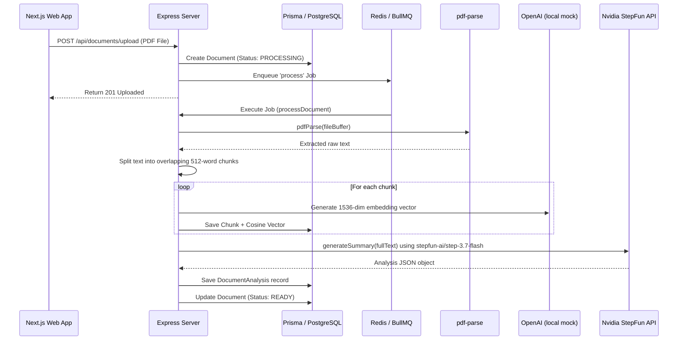
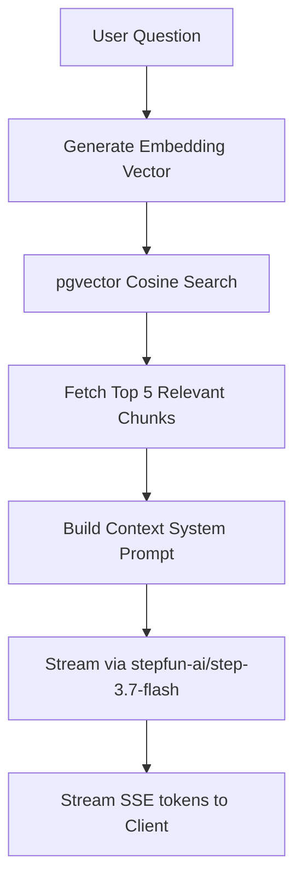

# AI Document Intelligence Platform - Architecture & Code Explanation

This document explains the technical architecture, data flow pipelines, and model configurations of the AI Document Intelligence Platform.

---

## 1. System Ingestion & Chunking Pipeline

When you drop a PDF into the dashboard, the following sequence occurs:



1. **Upload handler** ([documentController.ts](file:///Users/user/Desktop/AIdocument/apps/server/src/controllers/documentController.ts)): Accepts the PDF file via `Multer` validation, creates a `Document` record in PostgreSQL with a status of `PROCESSING`, and enqueues a background job in `BullMQ`.
2. **Text parsing & Ingestion** ([documentService.ts](file:///Users/user/Desktop/AIdocument/apps/server/src/services/documentService.ts)):
   - **pdf-parse** extracts the raw text blocks and calculates the total page count.
   - Text is split into overlapping chunks (512 words, 50-word overlap) to keep context boundaries intact.
   - For each chunk, the application generates a 1536-dimension vector embedding and stores it directly in the `DocumentChunk` table using PostgreSQL's **pgvector** data type (`vector(1536)`).
3. **Structured Summary & Extracted Data**:
   - The full text is sent to the **Nvidia StepFun API** (`stepfun-ai/step-3.7-flash`).
   - The model generates an executive summary, key bulleted insights, classifies document types, and extracts structured key-value pairs (Dates, Parties, Amounts, Clauses) returned as a JSON object to populate the `DocumentAnalysis` table.

---

## 2. RAG Pipeline (Retrieval-Augmented Generation)

When a user chats with a document:



1. **Semantic Matching** ([chatService.ts](file:///Users/user/Desktop/AIdocument/apps/server/src/services/chatService.ts)):
   - We generate a vector embedding for the user's question.
   - We execute a raw SQL similarity search against the `DocumentChunk` table using the cosine distance operator (`<=>`):
     ```sql
     SELECT id, content, "pageNumber", (1 - (embedding <=> $1::vector)) as score 
     FROM "DocumentChunk" 
     WHERE "documentId" = $2 
     ORDER BY embedding <=> $1::vector 
     LIMIT 5;
     ```
2. **Augmented Prompt Assembly**:
   - The content from the top 5 most relevant chunks is injected directly into the LLM system prompt as the context.
3. **Nvidia StepFun Streaming**:
   - The query and context are dispatched to the Nvidia endpoint. 
   - A Server-Sent Events (SSE) stream (`text/event-stream`) is established. As the tokens arrive from the model, they are forwarded directly to the client browser in real time.
   - **Inline Citations**: The citations are parsed and linked to corresponding page numbers so clicking on a chat chip automatically scrolls the PDF viewer.

---

## 3. Integration with Nvidia StepFun API

The application has been integrated to use the **Nvidia StepFun API** (`stepfun-ai/step-3.7-flash`).

### OpenAI Client Redirection ([openai.ts](file:///Users/user/Desktop/AIdocument/apps/server/src/lib/openai.ts))
By utilizing the standard `openai` npm package, we simply override the `baseURL` and apply your Nvidia API key:
```typescript
import OpenAI from 'openai';

const apiKey = process.env.NVIDIA_API_KEY || '';

export const openai = new OpenAI({
  apiKey,
  baseURL: 'https://integrate.api.nvidia.com/v1',
});
```

### Prompt Execution
The services then invoke the `stepfun-ai/step-3.7-flash` model for summarization, entity extraction, and Q&A streaming:
```typescript
const stream = await openai.chat.completions.create({
  model: 'stepfun-ai/step-3.7-flash',
  messages: [...],
  stream: true,
});
```
